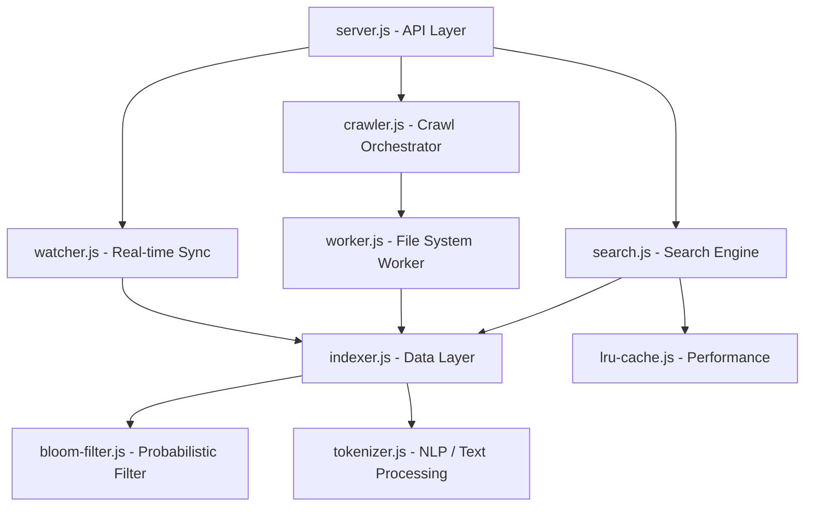

# Backend Technical Documentation - FileExplorer

This document provides a deep dive into the architectural principles, module responsibilities, and performance optimizations implemented in the FileExplorer backend.

---

## 1. Clean Architecture Overview

The system follows a modular, decoupled architecture where each component has a single, well-defined responsibility. This ensures maintainability, testability, and scalability.

### Layers:
1.  **Orchestration Layer (`server.js`)**: Manages the HTTP server, initializes sub-systems, and routes requests.
2.  **Domain Logic Layer (`search.js`, `crawler.js`)**: Contains the core business logic for ranking results and managing crawl processes.
3.  **Data Layer (`indexer.js`)**: Manages the Inverted Index, Forward Index, and persistence to disk.
4.  **Utility/Optimisation Layer (`bloom-filter.js`, `lru-cache.js`, `tokenizer.js`)**: Provides specialized data structures and performance enhancements.

---

## 2. Module Responsibilities

### Core System
-   **`server.js`**: The entry point. It bootstraps the Express server, triggers the initial crawl via the Orchestrator, and starts the real-time file watcher.
-   **`crawler/crawler.js`**: Orchestrates the initial full-system scan. It offloads heavy I/O and CPU tasks to **Worker Threads** to keep the main event loop responsive.
-   **`crawler/worker.js`**: The recursive file system crawler. It traverses directories, filters supported file types, and skips protected system files (`pagefile.sys`, etc.) to prevent `EBUSY` crashes.

### Indexing & Data Structures
-   **`crawler/indexer.js`**: The heart of the data layer.
    -   **Forward Index**: Maps file paths to file metadata (size, date).
    -   **Inverted Index**: Maps tokens (words/n-grams) to a set of file paths. This allows for instantaneous retrieval.
    -   **Persistence**: Saves the index to `indexes/file_index.json` to avoid re-crawling on restart.
-   **`crawler/tokenizer.js`**: Breaks filenames into searchable components. It uses **stems** and **n-grams** (trigrams/bigrams) to enable partial matching (e.g., searching "port" finds "report.pdf").
-   **`crawler/bloom-filter.js`**: A probabilistic data structure used to check if a token *might* exist in the index. If the Bloom filter says "no", we skip the index lookup entirely, saving time.

### Search & Ranking
-   **`crawler/search.js`**: Implements the retrieval and ranking algorithm.
    -   **Candidate Collection**: Uses the Inverted Index to find all files containing query tokens.
    -   **Scoring**:
        -   **Exact Match**: Highest weight.
        -   **Substring Match**: Medium weight.
        -   **Fuzzy Match**: Uses **Jaro-Winkler** distance to handle typos and approximate matches.
-   **`crawler/lru-cache.js`**: An Least Recently Used cache that stores the results of common search queries in memory, providing O(1) response times for frequent searches.

### Real-time Synchronization
-   **`crawler/watcher.js`**: Uses `chokidar` to listen for OS-level file events (Add, Change, Unlink). It updates the Inverted Index in real-time, ensuring the search results are always up-to-date without requiring a full re-scan.

---

## 3. Performance Optimizers

### I. Inverted Index (Constant Time Lookup)
Instead of searching every file name on every query (O(N)), we look up the token in a Map (O(1)). This reduces search time from seconds to milliseconds even with 100,000+ files.

### II. Worker Threads (Concurrency)
Crawling 100GB+ of files is CPU and I/O intensive. By using `worker_threads`, the main API remains responsive and can serve requests even while the initial crawl is in progress.

### III. Bloom Filter (Early Exit)
Before querying the Inverted Index, we check the Bloom Filter. This prevents unnecessary memory lookups for tokens that aren't present in the system, which is particularly effective for "typo" queries.

### IV. N-Gram Tokenization
By breaking "MySecretFile" into "MyS", "ySe", "Sec"... we allow users to find files even if they only remember a fragment of the name.

### V. LRU Caching
Repeat queries are common. The LRU cache ensures that "hot" search terms don't even hit the index layer, returning results instantly from memory.

---

## 4. Resilience & Error Handling

-   **Locked File Handling**: The system detects `EBUSY` and `EACCES` errors (common on Windows for `pagefile.sys` or `System Volume Information`) and gracefully skips them rather than crashing.
-   **Debounced Saving**: The indexer doesn't write to disk on every file change. It uses a 5-second debounce to batch updates, reducing disk wear and I/O overhead.
